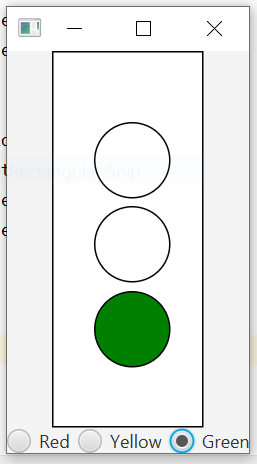
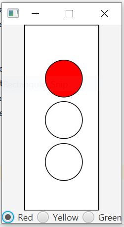
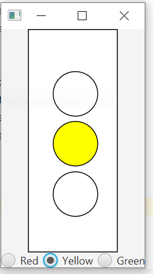

This was created as a project to practice with java gui. The code outputs a traffic light with three buttons on the bottom for red, yellow, and green.




## Imports
```java
import javafx.application.Application;
import javafx.geometry.Insets;
import javafx.geometry.Pos;
import javafx.scene.Scene;
import javafx.scene.control.RadioButton;
import javafx.scene.control.ToggleGroup;
import javafx.scene.layout.BorderPane;
import javafx.scene.layout.GridPane;
import javafx.scene.layout.HBox;
import javafx.scene.layout.StackPane;
import javafx.scene.paint.Color;
import javafx.stage.Stage;
import javafx.scene.shape.*;
```
## Creating Basic Ingredients

Here I create a stage. I also create a Stack Pane and Rectange objects. 

```
public class TrafficLight extends Application {
    public static void main(String[] args) {
        launch(args);
    }

    @Override
    public void start(Stage primaryStage) {
        primaryStage.setTitle("Traffic Light");
        //create stackpane
        StackPane pane = new StackPane();
        Rectangle rectangle = new Rectangle(125, 250, 100, 250);

        //add rectangle to stackpane
        pane.getChildren().add(rectangle);
        rectangle.setFill(Color.WHITE);
        rectangle.setStroke(Color.BLACK);

        //create gridpane
        GridPane pane1 = new GridPane();
        pane1.setAlignment(Pos.CENTER);
        pane1.setPadding(new Insets(5, 5, 5, 5));
        pane1.setHgap(5);
        pane1.setVgap(5);

        //add gridpane to stackpane
        pane.getChildren().add(pane1);

        //create some circles
        Circle circle = new Circle();
        circle.setStroke(Color.BLACK);
        circle.setFill(Color.WHITE);
        circle.setRadius(25.0f);

        //add circle to gridpane
        pane1.add(circle,1,1);

        Circle circle2 = new Circle();
        circle2.setStroke(Color.BLACK);
        circle2.setFill(Color.WHITE);
        circle2.setRadius(25.0f);

        //add circle to gridpane and put it below the other circle
        pane1.add(circle2,1,2);

        Circle circle3 = new Circle();
        circle3.setStroke(Color.BLACK);
        circle3.setFill(Color.WHITE);
        circle3.setRadius(25.0f);
        //add circle to gridpane and put it below the other circle
        pane1.add(circle3,1,3);
        //create a toggle group
        final ToggleGroup group = new ToggleGroup();

        //make a radio button
        RadioButton rb1 = new RadioButton("Red");
        //put radio button in the toggle group
        rb1.setToggleGroup(group);


        RadioButton rb2 = new RadioButton("Yellow");
        rb2.setToggleGroup(group);

        RadioButton rb3 = new RadioButton("Green");
        rb3.setToggleGroup(group);

        //create Hbox
        HBox hBox = new HBox(5);
        //add the buttons to the hbox
        hBox.getChildren().addAll(rb1, rb2, rb3);
        hBox.setAlignment(Pos.CENTER);

        //create a border pane
        BorderPane borderPane = new BorderPane();
        //add border pane to stack pane
        borderPane.setCenter(pane);
        borderPane.setBottom(hBox);

        //create a scene with the border pane which now
        // contains a stackpane (the rectangle) and within
        // the stack pane a grid pane(the circles)
        Scene scene = new Scene(borderPane);
        //add the scene to the scene
        primaryStage.setScene(scene);
        primaryStage.show();

        //create action events for buttons
        rb1.setOnAction(e -> {
            circle.setFill(Color.RED);
            circle2.setFill(Color.WHITE);
            circle3.setFill(Color.WHITE);
        });

        rb2.setOnAction(e ->{
            circle.setFill(Color.WHITE);
            circle2.setFill(Color.YELLOW);
            circle3.setFill(Color.WHITE);
        });

        rb3.setOnAction(e ->{
            circle.setFill(Color.WHITE);
            circle2.setFill(Color.WHITE);
            circle3.setFill(Color.GREEN);
        });

    }
}
```
