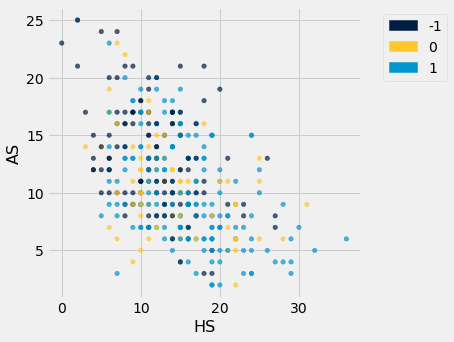

<style>
.tablelines table, .tablelines td, .tablelines th {
        border: 1px solid black;
        }
 </style>
# Soccer - Nearest Neighbor For Classification
# [Home](README.md)
This project explores a data set containing information about the results of soccer games. The data set contains 380 rows and 23 columns.
## Overview
In this project I explore a data set containing soccer game results using a jupyter notebook. I remove all columns not containing numbers and take the "FTR" column or full time results and assign win/lose/draw a number value. Next I plot the data on a scatter plot. Finally we can start building the classifier. I use a distance function to determine which points lie closest to our example point. After this we can chose how many points we want to compare our point to so we can make a prediction. 
<br/>_Note:This code was used in a class assignment that I modified for this data set. Also the comments within the code refrencing manchester united or manU was from a previous inquiry exploring selecting a single team and predicting for that one team._
### Home Shots vs Away Shots
1 = win 0 = draw -1 = lose

### Table of contents
- [PreProcessing](#preprocessing)
- [Visualization](#visualization)
- [Distance Function](#distance)
- [The Classifier](#the-classifier)
- [Examples](#examples)
- [Review of the Steps](#review-of-the-steps)
- [Short Comings](#short-comings)

### Import the data
```python
from datascience import *
import numpy as np
import matplotlib
import pandas as pd
from mpl_toolkits.mplot3d import Axes3D
%matplotlib inline
import matplotlib.pyplot as plots
plots.style.use('fivethirtyeight')
```


```python
##Import data from csv file
games = Table.read_table('2018-2019.csv')
games

##common knowledge needed for reading and understanding data set
##FTHG = Full Time Home Team Goals
##FTAG = Full Time Away Team Goals
##FTR = Full Time Result (H=Home Win, D=Draw, A=Away Win)
##HTHG = Half Time Home Team Goals
##HTAG = Half Time Away Team Goals
##HTR = Half Time Result (H=Home Win, D=Draw, A=Away Win)
##HS = Home Team Shots
##AS = Away Team Shots
##HST = Home Team Shots on Target
##AST = Away Team Shots on Target
##HHW = Home Team Hit Woodwork
##AHW = Away Team Hit Woodwork
##HC = Home Team Corners
##AC = Away Team Corners
##HF = Home Team Fouls Committed
##AF = Away Team Fouls Committed
##HO = Home Team Offsides
##AO = Away Team Offsides
##HY = Home Team Yellow Cards
##AY = Away Team Yellow Cards
##HR = Home Team Red Cards
##AR = Away Team Red Cards


```


<table border="1" class="dataframe">
    <thead>
        <tr>
            <th>Div</th> <th>Date</th> <th>HomeTeam</th> <th>AwayTeam</th> <th>FTHG</th> <th>FTAG</th> <th>FTR</th> <th>HTHG</th> <th>HTAG</th> <th>HTR</th> <th>Referee</th> <th>HS</th> <th>AS</th> <th>HST</th> <th>AST</th> <th>HF</th> <th>AF</th> <th>HC</th> <th>AC</th> <th>HY</th> <th>AY</th> <th>HR</th> <th>AR</th>
        </tr>
    </thead>
    <tbody>
        <tr>
            <td>E0  </td> <td>10/8/18</td> <td>Man United  </td> <td>Leicester     </td> <td>2   </td> <td>1   </td> <td>H   </td> <td>1   </td> <td>0   </td> <td>H   </td> <td>A Marriner</td> <td>8   </td> <td>13  </td> <td>6   </td> <td>4   </td> <td>11  </td> <td>8   </td> <td>2   </td> <td>5   </td> <td>2   </td> <td>1   </td> <td>0   </td> <td>0   </td>
        </tr>
    </tbody>
        <tr>
            <td>E0  </td> <td>11/8/18</td> <td>Bournemouth </td> <td>Cardiff       </td> <td>2   </td> <td>0   </td> <td>H   </td> <td>1   </td> <td>0   </td> <td>H   </td> <td>K Friend  </td> <td>12  </td> <td>10  </td> <td>4   </td> <td>1   </td> <td>11  </td> <td>9   </td> <td>7   </td> <td>4   </td> <td>1   </td> <td>1   </td> <td>0   </td> <td>0   </td>
        </tr>
    </tbody>
        <tr>
            <td>E0  </td> <td>11/8/18</td> <td>Fulham      </td> <td>Crystal Palace</td> <td>0   </td> <td>2   </td> <td>A   </td> <td>0   </td> <td>1   </td> <td>A   </td> <td>M Dean    </td> <td>15  </td> <td>10  </td> <td>6   </td> <td>9   </td> <td>9   </td> <td>11  </td> <td>5   </td> <td>5   </td> <td>1   </td> <td>2   </td> <td>0   </td> <td>0   </td>
        </tr>
    </tbody>
        <tr>
            <td>E0  </td> <td>11/8/18</td> <td>Huddersfield</td> <td>Chelsea       </td> <td>0   </td> <td>3   </td> <td>A   </td> <td>0   </td> <td>2   </td> <td>A   </td> <td>C Kavanagh</td> <td>6   </td> <td>13  </td> <td>1   </td> <td>4   </td> <td>9   </td> <td>8   </td> <td>2   </td> <td>5   </td> <td>2   </td> <td>1   </td> <td>0   </td> <td>0   </td>
        </tr>
    </tbody>
        <tr>
            <td>E0  </td> <td>11/8/18</td> <td>Newcastle   </td> <td>Tottenham     </td> <td>1   </td> <td>2   </td> <td>A   </td> <td>1   </td> <td>2   </td> <td>A   </td> <td>M Atkinson</td> <td>15  </td> <td>15  </td> <td>2   </td> <td>5   </td> <td>11  </td> <td>12  </td> <td>3   </td> <td>5   </td> <td>2   </td> <td>2   </td> <td>0   </td> <td>0   </td>
        </tr>
    </tbody>
        <tr>
            <td>E0  </td> <td>11/8/18</td> <td>Watford     </td> <td>Brighton      </td> <td>2   </td> <td>0   </td> <td>H   </td> <td>1   </td> <td>0   </td> <td>H   </td> <td>J Moss    </td> <td>19  </td> <td>6   </td> <td>5   </td> <td>0   </td> <td>10  </td> <td>16  </td> <td>8   </td> <td>2   </td> <td>2   </td> <td>2   </td> <td>0   </td> <td>0   </td>
        </tr>
    </tbody>
        <tr>
            <td>E0  </td> <td>11/8/18</td> <td>Wolves      </td> <td>Everton       </td> <td>2   </td> <td>2   </td> <td>D   </td> <td>1   </td> <td>1   </td> <td>D   </td> <td>C Pawson  </td> <td>11  </td> <td>6   </td> <td>4   </td> <td>5   </td> <td>8   </td> <td>7   </td> <td>3   </td> <td>6   </td> <td>0   </td> <td>1   </td> <td>0   </td> <td>1   </td>
        </tr>
    </tbody>
        <tr>
            <td>E0  </td> <td>12/8/18</td> <td>Arsenal     </td> <td>Man City      </td> <td>0   </td> <td>2   </td> <td>A   </td> <td>0   </td> <td>1   </td> <td>A   </td> <td>M Oliver  </td> <td>9   </td> <td>17  </td> <td>3   </td> <td>8   </td> <td>11  </td> <td>14  </td> <td>2   </td> <td>9   </td> <td>2   </td> <td>2   </td> <td>0   </td> <td>0   </td>
        </tr>
    </tbody>
        <tr>
            <td>E0  </td> <td>12/8/18</td> <td>Liverpool   </td> <td>West Ham      </td> <td>4   </td> <td>0   </td> <td>H   </td> <td>2   </td> <td>0   </td> <td>H   </td> <td>A Taylor  </td> <td>18  </td> <td>5   </td> <td>8   </td> <td>2   </td> <td>14  </td> <td>9   </td> <td>5   </td> <td>4   </td> <td>1   </td> <td>2   </td> <td>0   </td> <td>0   </td>
        </tr>
    </tbody>
        <tr>
            <td>E0  </td> <td>12/8/18</td> <td>Southampton </td> <td>Burnley       </td> <td>0   </td> <td>0   </td> <td>D   </td> <td>0   </td> <td>0   </td> <td>D   </td> <td>G Scott   </td> <td>18  </td> <td>16  </td> <td>3   </td> <td>6   </td> <td>10  </td> <td>9   </td> <td>8   </td> <td>5   </td> <td>0   </td> <td>1   </td> <td>0   </td> <td>0   </td>
        </tr>
    </tbody>
</table>
<p>... (370 rows omitted)</p>
{: .tablelines}
## PreProcessing


```python
##get number of columns and rows and print it
total_rows= len(games[0])
total_cols=len(games)
print("Number of Rows: "+str(total_rows))
print("Number of Columns: "+str(total_cols))
```

    Number of Rows: 380
    Number of Columns: 23


```python
##This code will look at man U's home games but you could look at the away games
##to see manU's home or away team change the variable name when you see ^^^^^^^^^^^ on the line above
teams = Table.read_table('2018-2019.csv').drop('Date').drop('AwayTeam')

teams.show(5)


```


<table border="1" class="dataframe">
    <thead>
        <tr>
            <th>Div</th> <th>HomeTeam</th> <th>FTHG</th> <th>FTAG</th> <th>FTR</th> <th>HTHG</th> <th>HTAG</th> <th>HTR</th> <th>Referee</th> <th>HS</th> <th>AS</th> <th>HST</th> <th>AST</th> <th>HF</th> <th>AF</th> <th>HC</th> <th>AC</th> <th>HY</th> <th>AY</th> <th>HR</th> <th>AR</th>
        </tr>
    </thead>
    <tbody>
        <tr>
            <td>E0  </td> <td>Man United  </td> <td>2   </td> <td>1   </td> <td>H   </td> <td>1   </td> <td>0   </td> <td>H   </td> <td>A Marriner</td> <td>8   </td> <td>13  </td> <td>6   </td> <td>4   </td> <td>11  </td> <td>8   </td> <td>2   </td> <td>5   </td> <td>2   </td> <td>1   </td> <td>0   </td> <td>0   </td>
        </tr>
    </tbody>
        <tr>
            <td>E0  </td> <td>Bournemouth </td> <td>2   </td> <td>0   </td> <td>H   </td> <td>1   </td> <td>0   </td> <td>H   </td> <td>K Friend  </td> <td>12  </td> <td>10  </td> <td>4   </td> <td>1   </td> <td>11  </td> <td>9   </td> <td>7   </td> <td>4   </td> <td>1   </td> <td>1   </td> <td>0   </td> <td>0   </td>
        </tr>
    </tbody>
        <tr>
            <td>E0  </td> <td>Fulham      </td> <td>0   </td> <td>2   </td> <td>A   </td> <td>0   </td> <td>1   </td> <td>A   </td> <td>M Dean    </td> <td>15  </td> <td>10  </td> <td>6   </td> <td>9   </td> <td>9   </td> <td>11  </td> <td>5   </td> <td>5   </td> <td>1   </td> <td>2   </td> <td>0   </td> <td>0   </td>
        </tr>
    </tbody>
        <tr>
            <td>E0  </td> <td>Huddersfield</td> <td>0   </td> <td>3   </td> <td>A   </td> <td>0   </td> <td>2   </td> <td>A   </td> <td>C Kavanagh</td> <td>6   </td> <td>13  </td> <td>1   </td> <td>4   </td> <td>9   </td> <td>8   </td> <td>2   </td> <td>5   </td> <td>2   </td> <td>1   </td> <td>0   </td> <td>0   </td>
        </tr>
    </tbody>
        <tr>
            <td>E0  </td> <td>Newcastle   </td> <td>1   </td> <td>2   </td> <td>A   </td> <td>1   </td> <td>2   </td> <td>A   </td> <td>M Atkinson</td> <td>15  </td> <td>15  </td> <td>2   </td> <td>5   </td> <td>11  </td> <td>12  </td> <td>3   </td> <td>5   </td> <td>2   </td> <td>2   </td> <td>0   </td> <td>0   </td>
        </tr>
    </tbody>
</table>
<p>... (375 rows omitted)</p>
{: .tablelines}

```python

#show all the teams
##^^^^^^^^^^^^^
teams.group('HomeTeam')
```


<table border="1" class="dataframe">
    <thead>
        <tr>
            <th>HomeTeam</th> <th>count</th>
        </tr>
    </thead>
    <tbody>
        <tr>
            <td>Arsenal       </td> <td>19   </td>
        </tr>
    </tbody>
        <tr>
            <td>Bournemouth   </td> <td>19   </td>
        </tr>
    </tbody>
        <tr>
            <td>Brighton      </td> <td>19   </td>
        </tr>
    </tbody>
        <tr>
            <td>Burnley       </td> <td>19   </td>
        </tr>
    </tbody>
        <tr>
            <td>Cardiff       </td> <td>19   </td>
        </tr>
    </tbody>
        <tr>
            <td>Chelsea       </td> <td>19   </td>
        </tr>
    </tbody>
        <tr>
            <td>Crystal Palace</td> <td>19   </td>
        </tr>
    </tbody>
        <tr>
            <td>Everton       </td> <td>19   </td>
        </tr>
    </tbody>
        <tr>
            <td>Fulham        </td> <td>19   </td>
        </tr>
    </tbody>
        <tr>
            <td>Huddersfield  </td> <td>19   </td>
        </tr>
    </tbody>
</table>
<p>... (10 rows omitted)</p>
{: .tablelines}


```python
##selecting only where the manchester united team appears
##^^^^^^^^^^^^
##manU = teams.where('HomeTeam', are.equal_to('Man United'))
##manU
games
```


<table border="1" class="dataframe">
    <thead>
        <tr>
            <th>Div</th> <th>Date</th> <th>HomeTeam</th> <th>AwayTeam</th> <th>FTHG</th> <th>FTAG</th> <th>FTR</th> <th>HTHG</th> <th>HTAG</th> <th>HTR</th> <th>Referee</th> <th>HS</th> <th>AS</th> <th>HST</th> <th>AST</th> <th>HF</th> <th>AF</th> <th>HC</th> <th>AC</th> <th>HY</th> <th>AY</th> <th>HR</th> <th>AR</th>
        </tr>
    </thead>
    <tbody>
        <tr>
            <td>E0  </td> <td>10/8/18</td> <td>Man United  </td> <td>Leicester     </td> <td>2   </td> <td>1   </td> <td>H   </td> <td>1   </td> <td>0   </td> <td>H   </td> <td>A Marriner</td> <td>8   </td> <td>13  </td> <td>6   </td> <td>4   </td> <td>11  </td> <td>8   </td> <td>2   </td> <td>5   </td> <td>2   </td> <td>1   </td> <td>0   </td> <td>0   </td>
        </tr>
    </tbody>
        <tr>
            <td>E0  </td> <td>11/8/18</td> <td>Bournemouth </td> <td>Cardiff       </td> <td>2   </td> <td>0   </td> <td>H   </td> <td>1   </td> <td>0   </td> <td>H   </td> <td>K Friend  </td> <td>12  </td> <td>10  </td> <td>4   </td> <td>1   </td> <td>11  </td> <td>9   </td> <td>7   </td> <td>4   </td> <td>1   </td> <td>1   </td> <td>0   </td> <td>0   </td>
        </tr>
    </tbody>
        <tr>
            <td>E0  </td> <td>11/8/18</td> <td>Fulham      </td> <td>Crystal Palace</td> <td>0   </td> <td>2   </td> <td>A   </td> <td>0   </td> <td>1   </td> <td>A   </td> <td>M Dean    </td> <td>15  </td> <td>10  </td> <td>6   </td> <td>9   </td> <td>9   </td> <td>11  </td> <td>5   </td> <td>5   </td> <td>1   </td> <td>2   </td> <td>0   </td> <td>0   </td>
        </tr>
    </tbody>
        <tr>
            <td>E0  </td> <td>11/8/18</td> <td>Huddersfield</td> <td>Chelsea       </td> <td>0   </td> <td>3   </td> <td>A   </td> <td>0   </td> <td>2   </td> <td>A   </td> <td>C Kavanagh</td> <td>6   </td> <td>13  </td> <td>1   </td> <td>4   </td> <td>9   </td> <td>8   </td> <td>2   </td> <td>5   </td> <td>2   </td> <td>1   </td> <td>0   </td> <td>0   </td>
        </tr>
    </tbody>
        <tr>
            <td>E0  </td> <td>11/8/18</td> <td>Newcastle   </td> <td>Tottenham     </td> <td>1   </td> <td>2   </td> <td>A   </td> <td>1   </td> <td>2   </td> <td>A   </td> <td>M Atkinson</td> <td>15  </td> <td>15  </td> <td>2   </td> <td>5   </td> <td>11  </td> <td>12  </td> <td>3   </td> <td>5   </td> <td>2   </td> <td>2   </td> <td>0   </td> <td>0   </td>
        </tr>
    </tbody>
        <tr>
            <td>E0  </td> <td>11/8/18</td> <td>Watford     </td> <td>Brighton      </td> <td>2   </td> <td>0   </td> <td>H   </td> <td>1   </td> <td>0   </td> <td>H   </td> <td>J Moss    </td> <td>19  </td> <td>6   </td> <td>5   </td> <td>0   </td> <td>10  </td> <td>16  </td> <td>8   </td> <td>2   </td> <td>2   </td> <td>2   </td> <td>0   </td> <td>0   </td>
        </tr>
    </tbody>
        <tr>
            <td>E0  </td> <td>11/8/18</td> <td>Wolves      </td> <td>Everton       </td> <td>2   </td> <td>2   </td> <td>D   </td> <td>1   </td> <td>1   </td> <td>D   </td> <td>C Pawson  </td> <td>11  </td> <td>6   </td> <td>4   </td> <td>5   </td> <td>8   </td> <td>7   </td> <td>3   </td> <td>6   </td> <td>0   </td> <td>1   </td> <td>0   </td> <td>1   </td>
        </tr>
    </tbody>
        <tr>
            <td>E0  </td> <td>12/8/18</td> <td>Arsenal     </td> <td>Man City      </td> <td>0   </td> <td>2   </td> <td>A   </td> <td>0   </td> <td>1   </td> <td>A   </td> <td>M Oliver  </td> <td>9   </td> <td>17  </td> <td>3   </td> <td>8   </td> <td>11  </td> <td>14  </td> <td>2   </td> <td>9   </td> <td>2   </td> <td>2   </td> <td>0   </td> <td>0   </td>
        </tr>
    </tbody>
        <tr>
            <td>E0  </td> <td>12/8/18</td> <td>Liverpool   </td> <td>West Ham      </td> <td>4   </td> <td>0   </td> <td>H   </td> <td>2   </td> <td>0   </td> <td>H   </td> <td>A Taylor  </td> <td>18  </td> <td>5   </td> <td>8   </td> <td>2   </td> <td>14  </td> <td>9   </td> <td>5   </td> <td>4   </td> <td>1   </td> <td>2   </td> <td>0   </td> <td>0   </td>
        </tr>
    </tbody>
        <tr>
            <td>E0  </td> <td>12/8/18</td> <td>Southampton </td> <td>Burnley       </td> <td>0   </td> <td>0   </td> <td>D   </td> <td>0   </td> <td>0   </td> <td>D   </td> <td>G Scott   </td> <td>18  </td> <td>16  </td> <td>3   </td> <td>6   </td> <td>10  </td> <td>9   </td> <td>8   </td> <td>5   </td> <td>0   </td> <td>1   </td> <td>0   </td> <td>0   </td>
        </tr>
    </tbody>
</table>
<p>... (370 rows omitted)</p>
{: .tablelines}


```python
##A = away team win H = home team win D = draw
##NOTE WHETHER YOU ARE LOOKING WHETHER MANCHESTER UNITED WAS PLAYING HOME OR AWAY
##Display wins and loses
wins = games.group('FTR')
wins
```


<table border="1" class="dataframe">
    <thead>
        <tr>
            <th>FTR</th> <th>count</th>
        </tr>
    </thead>
    <tbody>
        <tr>
            <td>A   </td> <td>128  </td>
        </tr>
    </tbody>
        <tr>
            <td>D   </td> <td>71   </td>
        </tr>
    </tbody>
        <tr>
            <td>H   </td> <td>181  </td>
        </tr>
    </tbody>
</table>
{: .tablelines}


```python
##take the letters that represent the win/loses and make them 0 = lose 1 =win .5 =draw
def makeitnumbers(x):
    if x == 'H':
        return 1
    elif x== 'A':
        return  -1
    else:
        return 0

##add the column with the numbers to the table
games = games.with_column(
    'winlose', games.apply(makeitnumbers, 'FTR')
)
games
```


<table border="1" class="dataframe">
    <thead>
        <tr>
            <th>Div</th> <th>Date</th> <th>HomeTeam</th> <th>AwayTeam</th> <th>FTHG</th> <th>FTAG</th> <th>FTR</th> <th>HTHG</th> <th>HTAG</th> <th>HTR</th> <th>Referee</th> <th>HS</th> <th>AS</th> <th>HST</th> <th>AST</th> <th>HF</th> <th>AF</th> <th>HC</th> <th>AC</th> <th>HY</th> <th>AY</th> <th>HR</th> <th>AR</th> <th>winlose</th>
        </tr>
    </thead>
    <tbody>
        <tr>
            <td>E0  </td> <td>10/8/18</td> <td>Man United  </td> <td>Leicester     </td> <td>2   </td> <td>1   </td> <td>H   </td> <td>1   </td> <td>0   </td> <td>H   </td> <td>A Marriner</td> <td>8   </td> <td>13  </td> <td>6   </td> <td>4   </td> <td>11  </td> <td>8   </td> <td>2   </td> <td>5   </td> <td>2   </td> <td>1   </td> <td>0   </td> <td>0   </td> <td>1      </td>
        </tr>
    </tbody>
        <tr>
            <td>E0  </td> <td>11/8/18</td> <td>Bournemouth </td> <td>Cardiff       </td> <td>2   </td> <td>0   </td> <td>H   </td> <td>1   </td> <td>0   </td> <td>H   </td> <td>K Friend  </td> <td>12  </td> <td>10  </td> <td>4   </td> <td>1   </td> <td>11  </td> <td>9   </td> <td>7   </td> <td>4   </td> <td>1   </td> <td>1   </td> <td>0   </td> <td>0   </td> <td>1      </td>
        </tr>
    </tbody>
        <tr>
            <td>E0  </td> <td>11/8/18</td> <td>Fulham      </td> <td>Crystal Palace</td> <td>0   </td> <td>2   </td> <td>A   </td> <td>0   </td> <td>1   </td> <td>A   </td> <td>M Dean    </td> <td>15  </td> <td>10  </td> <td>6   </td> <td>9   </td> <td>9   </td> <td>11  </td> <td>5   </td> <td>5   </td> <td>1   </td> <td>2   </td> <td>0   </td> <td>0   </td> <td>-1     </td>
        </tr>
    </tbody>
        <tr>
            <td>E0  </td> <td>11/8/18</td> <td>Huddersfield</td> <td>Chelsea       </td> <td>0   </td> <td>3   </td> <td>A   </td> <td>0   </td> <td>2   </td> <td>A   </td> <td>C Kavanagh</td> <td>6   </td> <td>13  </td> <td>1   </td> <td>4   </td> <td>9   </td> <td>8   </td> <td>2   </td> <td>5   </td> <td>2   </td> <td>1   </td> <td>0   </td> <td>0   </td> <td>-1     </td>
        </tr>
    </tbody>
        <tr>
            <td>E0  </td> <td>11/8/18</td> <td>Newcastle   </td> <td>Tottenham     </td> <td>1   </td> <td>2   </td> <td>A   </td> <td>1   </td> <td>2   </td> <td>A   </td> <td>M Atkinson</td> <td>15  </td> <td>15  </td> <td>2   </td> <td>5   </td> <td>11  </td> <td>12  </td> <td>3   </td> <td>5   </td> <td>2   </td> <td>2   </td> <td>0   </td> <td>0   </td> <td>-1     </td>
        </tr>
    </tbody>
        <tr>
            <td>E0  </td> <td>11/8/18</td> <td>Watford     </td> <td>Brighton      </td> <td>2   </td> <td>0   </td> <td>H   </td> <td>1   </td> <td>0   </td> <td>H   </td> <td>J Moss    </td> <td>19  </td> <td>6   </td> <td>5   </td> <td>0   </td> <td>10  </td> <td>16  </td> <td>8   </td> <td>2   </td> <td>2   </td> <td>2   </td> <td>0   </td> <td>0   </td> <td>1      </td>
        </tr>
    </tbody>
        <tr>
            <td>E0  </td> <td>11/8/18</td> <td>Wolves      </td> <td>Everton       </td> <td>2   </td> <td>2   </td> <td>D   </td> <td>1   </td> <td>1   </td> <td>D   </td> <td>C Pawson  </td> <td>11  </td> <td>6   </td> <td>4   </td> <td>5   </td> <td>8   </td> <td>7   </td> <td>3   </td> <td>6   </td> <td>0   </td> <td>1   </td> <td>0   </td> <td>1   </td> <td>0      </td>
        </tr>
    </tbody>
        <tr>
            <td>E0  </td> <td>12/8/18</td> <td>Arsenal     </td> <td>Man City      </td> <td>0   </td> <td>2   </td> <td>A   </td> <td>0   </td> <td>1   </td> <td>A   </td> <td>M Oliver  </td> <td>9   </td> <td>17  </td> <td>3   </td> <td>8   </td> <td>11  </td> <td>14  </td> <td>2   </td> <td>9   </td> <td>2   </td> <td>2   </td> <td>0   </td> <td>0   </td> <td>-1     </td>
        </tr>
    </tbody>
        <tr>
            <td>E0  </td> <td>12/8/18</td> <td>Liverpool   </td> <td>West Ham      </td> <td>4   </td> <td>0   </td> <td>H   </td> <td>2   </td> <td>0   </td> <td>H   </td> <td>A Taylor  </td> <td>18  </td> <td>5   </td> <td>8   </td> <td>2   </td> <td>14  </td> <td>9   </td> <td>5   </td> <td>4   </td> <td>1   </td> <td>2   </td> <td>0   </td> <td>0   </td> <td>1      </td>
        </tr>
    </tbody>
        <tr>
            <td>E0  </td> <td>12/8/18</td> <td>Southampton </td> <td>Burnley       </td> <td>0   </td> <td>0   </td> <td>D   </td> <td>0   </td> <td>0   </td> <td>D   </td> <td>G Scott   </td> <td>18  </td> <td>16  </td> <td>3   </td> <td>6   </td> <td>10  </td> <td>9   </td> <td>8   </td> <td>5   </td> <td>0   </td> <td>1   </td> <td>0   </td> <td>0   </td> <td>0      </td>
        </tr>
    </tbody>
</table>
<p>... (370 rows omitted)</p>

{: .tablelines}


```python
games = games.drop('FTR').drop('HTR')
games = games.drop('HomeTeam').drop('AwayTeam')
games = games.drop('Div').drop('Referee')
games = games.drop('Date')
games
```


<table border="1" class="dataframe">
    <thead>
        <tr>
            <th>FTHG</th> <th>FTAG</th> <th>HTHG</th> <th>HTAG</th> <th>HS</th> <th>AS</th> <th>HST</th> <th>AST</th> <th>HF</th> <th>AF</th> <th>HC</th> <th>AC</th> <th>HY</th> <th>AY</th> <th>HR</th> <th>AR</th> <th>winlose</th>
        </tr>
    </thead>
    <tbody>
        <tr>
            <td>2   </td> <td>1   </td> <td>1   </td> <td>0   </td> <td>8   </td> <td>13  </td> <td>6   </td> <td>4   </td> <td>11  </td> <td>8   </td> <td>2   </td> <td>5   </td> <td>2   </td> <td>1   </td> <td>0   </td> <td>0   </td> <td>1      </td>
        </tr>
    </tbody>
        <tr>
            <td>2   </td> <td>0   </td> <td>1   </td> <td>0   </td> <td>12  </td> <td>10  </td> <td>4   </td> <td>1   </td> <td>11  </td> <td>9   </td> <td>7   </td> <td>4   </td> <td>1   </td> <td>1   </td> <td>0   </td> <td>0   </td> <td>1      </td>
        </tr>
    </tbody>
        <tr>
            <td>0   </td> <td>2   </td> <td>0   </td> <td>1   </td> <td>15  </td> <td>10  </td> <td>6   </td> <td>9   </td> <td>9   </td> <td>11  </td> <td>5   </td> <td>5   </td> <td>1   </td> <td>2   </td> <td>0   </td> <td>0   </td> <td>-1     </td>
        </tr>
    </tbody>
        <tr>
            <td>0   </td> <td>3   </td> <td>0   </td> <td>2   </td> <td>6   </td> <td>13  </td> <td>1   </td> <td>4   </td> <td>9   </td> <td>8   </td> <td>2   </td> <td>5   </td> <td>2   </td> <td>1   </td> <td>0   </td> <td>0   </td> <td>-1     </td>
        </tr>
    </tbody>
        <tr>
            <td>1   </td> <td>2   </td> <td>1   </td> <td>2   </td> <td>15  </td> <td>15  </td> <td>2   </td> <td>5   </td> <td>11  </td> <td>12  </td> <td>3   </td> <td>5   </td> <td>2   </td> <td>2   </td> <td>0   </td> <td>0   </td> <td>-1     </td>
        </tr>
    </tbody>
        <tr>
            <td>2   </td> <td>0   </td> <td>1   </td> <td>0   </td> <td>19  </td> <td>6   </td> <td>5   </td> <td>0   </td> <td>10  </td> <td>16  </td> <td>8   </td> <td>2   </td> <td>2   </td> <td>2   </td> <td>0   </td> <td>0   </td> <td>1      </td>
        </tr>
    </tbody>
        <tr>
            <td>2   </td> <td>2   </td> <td>1   </td> <td>1   </td> <td>11  </td> <td>6   </td> <td>4   </td> <td>5   </td> <td>8   </td> <td>7   </td> <td>3   </td> <td>6   </td> <td>0   </td> <td>1   </td> <td>0   </td> <td>1   </td> <td>0      </td>
        </tr>
    </tbody>
        <tr>
            <td>0   </td> <td>2   </td> <td>0   </td> <td>1   </td> <td>9   </td> <td>17  </td> <td>3   </td> <td>8   </td> <td>11  </td> <td>14  </td> <td>2   </td> <td>9   </td> <td>2   </td> <td>2   </td> <td>0   </td> <td>0   </td> <td>-1     </td>
        </tr>
    </tbody>
        <tr>
            <td>4   </td> <td>0   </td> <td>2   </td> <td>0   </td> <td>18  </td> <td>5   </td> <td>8   </td> <td>2   </td> <td>14  </td> <td>9   </td> <td>5   </td> <td>4   </td> <td>1   </td> <td>2   </td> <td>0   </td> <td>0   </td> <td>1      </td>
        </tr>
    </tbody>
        <tr>
            <td>0   </td> <td>0   </td> <td>0   </td> <td>0   </td> <td>18  </td> <td>16  </td> <td>3   </td> <td>6   </td> <td>10  </td> <td>9   </td> <td>8   </td> <td>5   </td> <td>0   </td> <td>1   </td> <td>0   </td> <td>0   </td> <td>0      </td>
        </tr>
    </tbody>
</table>
<p>... (370 rows omitted)</p>
{: .tablelines}

## Visualization

```python
##patients = Table.read_table(ckd).drop('ID')

def randomize_column(a):
    return a + np.random.normal(0.0, 0.09, size=len(a))

jittered = Table().with_columns([
        'Home Shots (jittered)', 
        randomize_column(games.column('HS')),
        'Away Shots(jittered)', 
        randomize_column(games.column('AS')),
        'Full Time Results',
        games.column('winlose')
    ])
```


```python
games
```


<table border="1" class="dataframe">
    <thead>
        <tr>
            <th>FTHG</th> <th>FTAG</th> <th>HTHG</th> <th>HTAG</th> <th>HS</th> <th>AS</th> <th>HST</th> <th>AST</th> <th>HF</th> <th>AF</th> <th>HC</th> <th>AC</th> <th>HY</th> <th>AY</th> <th>HR</th> <th>AR</th> <th>winlose</th>
        </tr>
    </thead>
    <tbody>
        <tr>
            <td>2   </td> <td>1   </td> <td>1   </td> <td>0   </td> <td>8   </td> <td>13  </td> <td>6   </td> <td>4   </td> <td>11  </td> <td>8   </td> <td>2   </td> <td>5   </td> <td>2   </td> <td>1   </td> <td>0   </td> <td>0   </td> <td>1      </td>
        </tr>
    </tbody>
        <tr>
            <td>2   </td> <td>0   </td> <td>1   </td> <td>0   </td> <td>12  </td> <td>10  </td> <td>4   </td> <td>1   </td> <td>11  </td> <td>9   </td> <td>7   </td> <td>4   </td> <td>1   </td> <td>1   </td> <td>0   </td> <td>0   </td> <td>1      </td>
        </tr>
    </tbody>
        <tr>
            <td>0   </td> <td>2   </td> <td>0   </td> <td>1   </td> <td>15  </td> <td>10  </td> <td>6   </td> <td>9   </td> <td>9   </td> <td>11  </td> <td>5   </td> <td>5   </td> <td>1   </td> <td>2   </td> <td>0   </td> <td>0   </td> <td>-1     </td>
        </tr>
    </tbody>
        <tr>
            <td>0   </td> <td>3   </td> <td>0   </td> <td>2   </td> <td>6   </td> <td>13  </td> <td>1   </td> <td>4   </td> <td>9   </td> <td>8   </td> <td>2   </td> <td>5   </td> <td>2   </td> <td>1   </td> <td>0   </td> <td>0   </td> <td>-1     </td>
        </tr>
    </tbody>
        <tr>
            <td>1   </td> <td>2   </td> <td>1   </td> <td>2   </td> <td>15  </td> <td>15  </td> <td>2   </td> <td>5   </td> <td>11  </td> <td>12  </td> <td>3   </td> <td>5   </td> <td>2   </td> <td>2   </td> <td>0   </td> <td>0   </td> <td>-1     </td>
        </tr>
    </tbody>
        <tr>
            <td>2   </td> <td>0   </td> <td>1   </td> <td>0   </td> <td>19  </td> <td>6   </td> <td>5   </td> <td>0   </td> <td>10  </td> <td>16  </td> <td>8   </td> <td>2   </td> <td>2   </td> <td>2   </td> <td>0   </td> <td>0   </td> <td>1      </td>
        </tr>
    </tbody>
        <tr>
            <td>2   </td> <td>2   </td> <td>1   </td> <td>1   </td> <td>11  </td> <td>6   </td> <td>4   </td> <td>5   </td> <td>8   </td> <td>7   </td> <td>3   </td> <td>6   </td> <td>0   </td> <td>1   </td> <td>0   </td> <td>1   </td> <td>0      </td>
        </tr>
    </tbody>
        <tr>
            <td>0   </td> <td>2   </td> <td>0   </td> <td>1   </td> <td>9   </td> <td>17  </td> <td>3   </td> <td>8   </td> <td>11  </td> <td>14  </td> <td>2   </td> <td>9   </td> <td>2   </td> <td>2   </td> <td>0   </td> <td>0   </td> <td>-1     </td>
        </tr>
    </tbody>
        <tr>
            <td>4   </td> <td>0   </td> <td>2   </td> <td>0   </td> <td>18  </td> <td>5   </td> <td>8   </td> <td>2   </td> <td>14  </td> <td>9   </td> <td>5   </td> <td>4   </td> <td>1   </td> <td>2   </td> <td>0   </td> <td>0   </td> <td>1      </td>
        </tr>
    </tbody>
        <tr>
            <td>0   </td> <td>0   </td> <td>0   </td> <td>0   </td> <td>18  </td> <td>16  </td> <td>3   </td> <td>6   </td> <td>10  </td> <td>9   </td> <td>8   </td> <td>5   </td> <td>0   </td> <td>1   </td> <td>0   </td> <td>0   </td> <td>0      </td>
        </tr>
    </tbody>
</table>
<p>... (370 rows omitted)</p>


```python
games.scatter('HS', 'AS', colors='winlose')
```


```python
games
```


<table border="1" class="dataframe">
    <thead>
        <tr>
            <th>FTHG</th> <th>FTAG</th> <th>HTHG</th> <th>HTAG</th> <th>HS</th> <th>AS</th> <th>HST</th> <th>AST</th> <th>HF</th> <th>AF</th> <th>HC</th> <th>AC</th> <th>HY</th> <th>AY</th> <th>HR</th> <th>AR</th> <th>winlose</th>
        </tr>
    </thead>
    <tbody>
        <tr>
            <td>2   </td> <td>1   </td> <td>1   </td> <td>0   </td> <td>8   </td> <td>13  </td> <td>6   </td> <td>4   </td> <td>11  </td> <td>8   </td> <td>2   </td> <td>5   </td> <td>2   </td> <td>1   </td> <td>0   </td> <td>0   </td> <td>1      </td>
        </tr>
    </tbody>
        <tr>
            <td>2   </td> <td>0   </td> <td>1   </td> <td>0   </td> <td>12  </td> <td>10  </td> <td>4   </td> <td>1   </td> <td>11  </td> <td>9   </td> <td>7   </td> <td>4   </td> <td>1   </td> <td>1   </td> <td>0   </td> <td>0   </td> <td>1      </td>
        </tr>
    </tbody>
        <tr>
            <td>0   </td> <td>2   </td> <td>0   </td> <td>1   </td> <td>15  </td> <td>10  </td> <td>6   </td> <td>9   </td> <td>9   </td> <td>11  </td> <td>5   </td> <td>5   </td> <td>1   </td> <td>2   </td> <td>0   </td> <td>0   </td> <td>-1     </td>
        </tr>
    </tbody>
        <tr>
            <td>0   </td> <td>3   </td> <td>0   </td> <td>2   </td> <td>6   </td> <td>13  </td> <td>1   </td> <td>4   </td> <td>9   </td> <td>8   </td> <td>2   </td> <td>5   </td> <td>2   </td> <td>1   </td> <td>0   </td> <td>0   </td> <td>-1     </td>
        </tr>
    </tbody>
        <tr>
            <td>1   </td> <td>2   </td> <td>1   </td> <td>2   </td> <td>15  </td> <td>15  </td> <td>2   </td> <td>5   </td> <td>11  </td> <td>12  </td> <td>3   </td> <td>5   </td> <td>2   </td> <td>2   </td> <td>0   </td> <td>0   </td> <td>-1     </td>
        </tr>
    </tbody>
        <tr>
            <td>2   </td> <td>0   </td> <td>1   </td> <td>0   </td> <td>19  </td> <td>6   </td> <td>5   </td> <td>0   </td> <td>10  </td> <td>16  </td> <td>8   </td> <td>2   </td> <td>2   </td> <td>2   </td> <td>0   </td> <td>0   </td> <td>1      </td>
        </tr>
    </tbody>
        <tr>
            <td>2   </td> <td>2   </td> <td>1   </td> <td>1   </td> <td>11  </td> <td>6   </td> <td>4   </td> <td>5   </td> <td>8   </td> <td>7   </td> <td>3   </td> <td>6   </td> <td>0   </td> <td>1   </td> <td>0   </td> <td>1   </td> <td>0      </td>
        </tr>
    </tbody>
        <tr>
            <td>0   </td> <td>2   </td> <td>0   </td> <td>1   </td> <td>9   </td> <td>17  </td> <td>3   </td> <td>8   </td> <td>11  </td> <td>14  </td> <td>2   </td> <td>9   </td> <td>2   </td> <td>2   </td> <td>0   </td> <td>0   </td> <td>-1     </td>
        </tr>
    </tbody>
        <tr>
            <td>4   </td> <td>0   </td> <td>2   </td> <td>0   </td> <td>18  </td> <td>5   </td> <td>8   </td> <td>2   </td> <td>14  </td> <td>9   </td> <td>5   </td> <td>4   </td> <td>1   </td> <td>2   </td> <td>0   </td> <td>0   </td> <td>1      </td>
        </tr>
    </tbody>
        <tr>
            <td>0   </td> <td>0   </td> <td>0   </td> <td>0   </td> <td>18  </td> <td>16  </td> <td>3   </td> <td>6   </td> <td>10  </td> <td>9   </td> <td>8   </td> <td>5   </td> <td>0   </td> <td>1   </td> <td>0   </td> <td>0   </td> <td>0      </td>
        </tr>
    </tbody>
</table>
<p>... (370 rows omitted)</p>


## Distance 
This is the distance function to calculate the distance between two points or rows.


```python
def distance(pt1, pt2):
    """Return the distance between two points, represented as arrays"""
    return np.sqrt(sum((pt1 - pt2)**2))
```


```python
def row_distance(row1, row2):
    """Return the distance between two numerical rows of a table"""
    return distance(np.array(row1), np.array(row2))
```


```python
attributes = games.drop('FTR')
attributes.show(3)
```


<table border="1" class="dataframe">
    <thead>
        <tr>
            <th>FTHG</th> <th>FTAG</th> <th>HTHG</th> <th>HTAG</th> <th>HS</th> <th>AS</th> <th>HST</th> <th>AST</th> <th>HF</th> <th>AF</th> <th>HC</th> <th>AC</th> <th>HY</th> <th>AY</th> <th>HR</th> <th>AR</th> <th>winlose</th>
        </tr>
    </thead>
    <tbody>
        <tr>
            <td>2   </td> <td>1   </td> <td>1   </td> <td>0   </td> <td>8   </td> <td>13  </td> <td>6   </td> <td>4   </td> <td>11  </td> <td>8   </td> <td>2   </td> <td>5   </td> <td>2   </td> <td>1   </td> <td>0   </td> <td>0   </td> <td>1      </td>
        </tr>
    </tbody>
        <tr>
            <td>2   </td> <td>0   </td> <td>1   </td> <td>0   </td> <td>12  </td> <td>10  </td> <td>4   </td> <td>1   </td> <td>11  </td> <td>9   </td> <td>7   </td> <td>4   </td> <td>1   </td> <td>1   </td> <td>0   </td> <td>0   </td> <td>1      </td>
        </tr>
    </tbody>
        <tr>
            <td>0   </td> <td>2   </td> <td>0   </td> <td>1   </td> <td>15  </td> <td>10  </td> <td>6   </td> <td>9   </td> <td>9   </td> <td>11  </td> <td>5   </td> <td>5   </td> <td>1   </td> <td>2   </td> <td>0   </td> <td>0   </td> <td>-1     </td>
        </tr>
    </tbody>
</table>
<p>... (377 rows omitted)</p>


```python
row_distance(attributes.row(4), attributes.row(3))
```


    10.583005244258363


```python
##example show we have the distances
row_distance(attributes.row(0), attributes.row(2))
```


    10.862780491200215


```python
##example show the same point compared to itself
row_distance(attributes.row(2), attributes.row(2))
```


    0.0


## The Classifier
This is the actual classifier

```python
def distances(training, example):
    """Compute distance between example and every row in training.
    Return training augmented with Distance column"""
    distances = make_array()
    attributes_only = training.drop('Class')
    
    for row in attributes_only.rows:
        distances = np.append(distances, row_distance(row, example))
    
#   ^ SAME AS DOING:
#
#   for i in np.arange(attributes_only.num_rows):
#       row = attributes_only.row(i)
#       distances = np.append(distances, row_distance(row, example))
        
    return training.with_column('Distance_to_ex', distances)
```


```python
example = attributes.row(18)
example
```


    Row(FTHG=6, FTAG=1, HTHG=3, HTAG=1, HS=32, AS=5, HST=14, AST=1, HF=9, AF=4, HC=10, AC=3, HY=0, AY=2, HR=0, AR=0, winlose=1)


```python
distances(games.exclude(18), example).sort('Distance_to_ex')
```


<table border="1" class="dataframe">
    <thead>
        <tr>
            <th>FTHG</th> <th>FTAG</th> <th>HTHG</th> <th>HTAG</th> <th>HS</th> <th>AS</th> <th>HST</th> <th>AST</th> <th>HF</th> <th>AF</th> <th>HC</th> <th>AC</th> <th>HY</th> <th>AY</th> <th>HR</th> <th>AR</th> <th>winlose</th> <th>Distance_to_ex</th>
        </tr>
    </thead>
    <tbody>
        <tr>
            <td>2   </td> <td>0   </td> <td>0   </td> <td>0   </td> <td>29  </td> <td>3   </td> <td>12  </td> <td>1   </td> <td>11  </td> <td>7   </td> <td>12  </td> <td>0   </td> <td>2   </td> <td>0   </td> <td>0   </td> <td>1   </td> <td>1      </td> <td>8.88819       </td>
        </tr>
    </tbody>
        <tr>
            <td>3   </td> <td>0   </td> <td>2   </td> <td>0   </td> <td>28  </td> <td>9   </td> <td>9   </td> <td>3   </td> <td>7   </td> <td>7   </td> <td>10  </td> <td>4   </td> <td>0   </td> <td>0   </td> <td>0   </td> <td>0   </td> <td>1      </td> <td>9.53939       </td>
        </tr>
    </tbody>
        <tr>
            <td>2   </td> <td>0   </td> <td>0   </td> <td>0   </td> <td>26  </td> <td>5   </td> <td>10  </td> <td>1   </td> <td>8   </td> <td>5   </td> <td>8   </td> <td>2   </td> <td>1   </td> <td>0   </td> <td>0   </td> <td>0   </td> <td>1      </td> <td>9.53939       </td>
        </tr>
    </tbody>
        <tr>
            <td>2   </td> <td>0   </td> <td>1   </td> <td>0   </td> <td>29  </td> <td>4   </td> <td>9   </td> <td>0   </td> <td>9   </td> <td>10  </td> <td>10  </td> <td>2   </td> <td>1   </td> <td>1   </td> <td>0   </td> <td>0   </td> <td>1      </td> <td>9.84886       </td>
        </tr>
    </tbody>
        <tr>
            <td>5   </td> <td>0   </td> <td>1   </td> <td>0   </td> <td>24  </td> <td>5   </td> <td>10  </td> <td>0   </td> <td>11  </td> <td>5   </td> <td>10  </td> <td>1   </td> <td>2   </td> <td>2   </td> <td>0   </td> <td>0   </td> <td>1      </td> <td>10.0499       </td>
        </tr>
    </tbody>
        <tr>
            <td>2   </td> <td>2   </td> <td>0   </td> <td>0   </td> <td>28  </td> <td>6   </td> <td>9   </td> <td>4   </td> <td>10  </td> <td>9   </td> <td>11  </td> <td>3   </td> <td>1   </td> <td>3   </td> <td>0   </td> <td>0   </td> <td>0      </td> <td>10.3923       </td>
        </tr>
    </tbody>
        <tr>
            <td>3   </td> <td>0   </td> <td>2   </td> <td>0   </td> <td>24  </td> <td>3   </td> <td>9   </td> <td>0   </td> <td>6   </td> <td>3   </td> <td>12  </td> <td>1   </td> <td>1   </td> <td>0   </td> <td>0   </td> <td>1   </td> <td>1      </td> <td>11.4018       </td>
        </tr>
    </tbody>
        <tr>
            <td>3   </td> <td>1   </td> <td>1   </td> <td>0   </td> <td>25  </td> <td>10  </td> <td>11  </td> <td>3   </td> <td>9   </td> <td>5   </td> <td>5   </td> <td>2   </td> <td>0   </td> <td>0   </td> <td>0   </td> <td>0   </td> <td>1      </td> <td>11.4891       </td>
        </tr>
    </tbody>
        <tr>
            <td>1   </td> <td>0   </td> <td>0   </td> <td>0   </td> <td>30  </td> <td>7   </td> <td>7   </td> <td>2   </td> <td>10  </td> <td>9   </td> <td>8   </td> <td>2   </td> <td>2   </td> <td>4   </td> <td>0   </td> <td>0   </td> <td>1      </td> <td>11.5326       </td>
        </tr>
    </tbody>
        <tr>
            <td>2   </td> <td>0   </td> <td>1   </td> <td>0   </td> <td>28  </td> <td>4   </td> <td>8   </td> <td>1   </td> <td>4   </td> <td>10  </td> <td>10  </td> <td>3   </td> <td>0   </td> <td>3   </td> <td>0   </td> <td>0   </td> <td>1      </td> <td>11.7047       </td>
        </tr>
    </tbody>
</table>
<p>... (369 rows omitted)</p>


```python
def closest(training, example, k):
    """Return a table of the k closest neighbors to example"""
    return distances(training, example).sort('Distance_to_ex').take(np.arange(k))
```


```python
closest(games.exclude(18), example, 5)
```


<table border="1" class="dataframe">
    <thead>
        <tr>
            <th>FTHG</th> <th>FTAG</th> <th>HTHG</th> <th>HTAG</th> <th>HS</th> <th>AS</th> <th>HST</th> <th>AST</th> <th>HF</th> <th>AF</th> <th>HC</th> <th>AC</th> <th>HY</th> <th>AY</th> <th>HR</th> <th>AR</th> <th>winlose</th> <th>Distance_to_ex</th>
        </tr>
    </thead>
    <tbody>
        <tr>
            <td>2   </td> <td>0   </td> <td>0   </td> <td>0   </td> <td>29  </td> <td>3   </td> <td>12  </td> <td>1   </td> <td>11  </td> <td>7   </td> <td>12  </td> <td>0   </td> <td>2   </td> <td>0   </td> <td>0   </td> <td>1   </td> <td>1      </td> <td>8.88819       </td>
        </tr>
    </tbody>
        <tr>
            <td>3   </td> <td>0   </td> <td>2   </td> <td>0   </td> <td>28  </td> <td>9   </td> <td>9   </td> <td>3   </td> <td>7   </td> <td>7   </td> <td>10  </td> <td>4   </td> <td>0   </td> <td>0   </td> <td>0   </td> <td>0   </td> <td>1      </td> <td>9.53939       </td>
        </tr>
    </tbody>
        <tr>
            <td>2   </td> <td>0   </td> <td>0   </td> <td>0   </td> <td>26  </td> <td>5   </td> <td>10  </td> <td>1   </td> <td>8   </td> <td>5   </td> <td>8   </td> <td>2   </td> <td>1   </td> <td>0   </td> <td>0   </td> <td>0   </td> <td>1      </td> <td>9.53939       </td>
        </tr>
    </tbody>
        <tr>
            <td>2   </td> <td>0   </td> <td>1   </td> <td>0   </td> <td>29  </td> <td>4   </td> <td>9   </td> <td>0   </td> <td>9   </td> <td>10  </td> <td>10  </td> <td>2   </td> <td>1   </td> <td>1   </td> <td>0   </td> <td>0   </td> <td>1      </td> <td>9.84886       </td>
        </tr>
    </tbody>
        <tr>
            <td>5   </td> <td>0   </td> <td>1   </td> <td>0   </td> <td>24  </td> <td>5   </td> <td>10  </td> <td>0   </td> <td>11  </td> <td>5   </td> <td>10  </td> <td>1   </td> <td>2   </td> <td>2   </td> <td>0   </td> <td>0   </td> <td>1      </td> <td>10.0499       </td>
        </tr>
    </tbody>
</table>


```python
closest(games.exclude(18), example, 3).group('winlose').sort('count', descending=True)
```


<table border="1" class="dataframe">
    <thead>
        <tr>
            <th>winlose</th> <th>count</th>
        </tr>
    </thead>
    <tbody>
        <tr>
            <td>1      </td> <td>3    </td>
        </tr>
    </tbody>
</table>


```python
def majority_class(topk):
    """Return the class with the highest count"""
    return topk.group('winlose').sort('count', descending=True).column(0).item(0)
```


```python
def classify(training, example, k):
    "Return the majority class among the k nearest neighbors of example"
    return majority_class(closest(training, example, k))
```
## Examples

```python
classify(games.exclude(18), example, 3)
```


    1


```python
games.take(18)
```


<table border="1" class="dataframe">
    <thead>
        <tr>
            <th>FTHG</th> <th>FTAG</th> <th>HTHG</th> <th>HTAG</th> <th>HS</th> <th>AS</th> <th>HST</th> <th>AST</th> <th>HF</th> <th>AF</th> <th>HC</th> <th>AC</th> <th>HY</th> <th>AY</th> <th>HR</th> <th>AR</th> <th>winlose</th>
        </tr>
    </thead>
    <tbody>
        <tr>
            <td>6   </td> <td>1   </td> <td>3   </td> <td>1   </td> <td>32  </td> <td>5   </td> <td>14  </td> <td>1   </td> <td>9   </td> <td>4   </td> <td>10  </td> <td>3   </td> <td>0   </td> <td>2   </td> <td>0   </td> <td>0   </td> <td>1      </td>
        </tr>
    </tbody>
</table>


```python
new_example = attributes.row(10)
classify(games.exclude(10), new_example, 5)
```


    0


```python
games.take(10)
```


<table border="1" class="dataframe">
    <thead>
        <tr>
            <th>FTHG</th> <th>FTAG</th> <th>HTHG</th> <th>HTAG</th> <th>HS</th> <th>AS</th> <th>HST</th> <th>AST</th> <th>HF</th> <th>AF</th> <th>HC</th> <th>AC</th> <th>HY</th> <th>AY</th> <th>HR</th> <th>AR</th> <th>winlose</th>
        </tr>
    </thead>
    <tbody>
        <tr>
            <td>0   </td> <td>0   </td> <td>0   </td> <td>0   </td> <td>12  </td> <td>12  </td> <td>1   </td> <td>6   </td> <td>14  </td> <td>16  </td> <td>5   </td> <td>5   </td> <td>2   </td> <td>2   </td> <td>0   </td> <td>1   </td> <td>0      </td>
        </tr>
    </tbody>
</table>


```python
another_example = attributes.row(15)
classify(games.exclude(15), another_example, 5)
```


    1


```python
games.take(15)
```


<table border="1" class="dataframe">
    <thead>
        <tr>
            <th>FTHG</th> <th>FTAG</th> <th>HTHG</th> <th>HTAG</th> <th>HS</th> <th>AS</th> <th>HST</th> <th>AST</th> <th>HF</th> <th>AF</th> <th>HC</th> <th>AC</th> <th>HY</th> <th>AY</th> <th>HR</th> <th>AR</th> <th>winlose</th>
        </tr>
    </thead>
    <tbody>
        <tr>
            <td>1   </td> <td>2   </td> <td>1   </td> <td>0   </td> <td>11  </td> <td>12  </td> <td>5   </td> <td>5   </td> <td>14  </td> <td>10  </td> <td>6   </td> <td>4   </td> <td>6   </td> <td>2   </td> <td>0   </td> <td>0   </td> <td>-1     </td>
        </tr>
    </tbody>
</table>


## Review of the Steps 

- `distance(pt1, pt2)`: Returns the distance between the arrays `pt1` and `pt2`
- `row_distance(row1, row2)`: Returns the distance between the rows `row1` and `row2`
- `distances(training, example)`: Returns a table that is `training` with an additional column `'Distance'` that contains the distance between `example` and each row of `training`
- `closest(training, example, k)`: Returns a table of the rows corresponding to the k smallest distances 
- `majority_class(topk)`: Returns the majority class in the `'Class'` column
- `classify(training, example, k)`: Returns the predicted class of `example` based on a `k` nearest neighbors classifier using the historical sample `training`


```python
##get number of columns and rows and print it
total_rows= len(games[0])
total_cols=len(games)
print("Number of Rows: "+str(total_rows))
print("Number of Columns: "+str(total_cols))
```

    Number of Rows: 380
    Number of Columns: 17
    
## Short Comings
Coming soon, this project is still in progress.
